# 🎞️ Kometa Custom Config

Custom overlays, collections, and posters for [Kometa](https://github.com/Kometa-Team/Kometa) 


## 🖼️ Overlay Styles

### `style_v1` (TV)

<p float="left">
  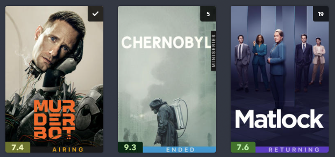
</p>

### `style_v2` (TV)

<p float="left">
  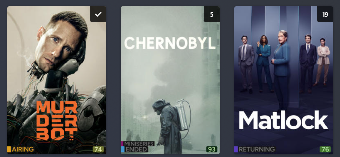
</p>

### `style_v1` (Movies)

<p float="left">
  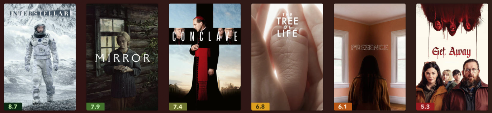
</p>

### `style_v2` (Movies)

<p float="left">
  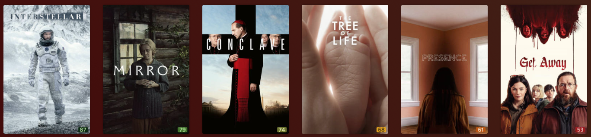
</p>


## ⚙️ Configuration

> [!NOTE]  
>  **Copy the entire `craftwork2720` folder into your Kometa `config/` directory.**


### `style_v1`
```yaml
libraries:
  Movies:
    overlay_files:
    - file: config/craftwork2720/overlays/style_v1/rating  # audience_rating
    operations:
      mass_audience_rating_update:
      - imdb
      - tmdb
      - 2.0
  Series:
    collection_files:
    # - file: config/craftwork2720/collections/miniseries
    overlay_files:
    # - file: config/craftwork2720/overlays/style_v1/miniseries
    - file: config/craftwork2720/overlays/style_v1/status
    - file: config/craftwork2720/overlays/style_v1/rating  # audience_rating
    operations:
      mass_audience_rating_update:
      - imdb
      - tmdb
      - 2.0
```

### `style_v2`

```yaml
libraries:
  Movies:
    overlay_files:
    - file: config/craftwork2720/overlays/style_v2/rating  # audience_rating
    operations:
      mass_audience_rating_update:
      - imdb
      - tmdb
      - 2.0
  Series:
    collection_files:
    # - file: config/craftwork2720/collections/miniseries
    overlay_files:
    # - file: config/craftwork2720/overlays/style_v2/miniseries
    - file: config/craftwork2720/overlays/style_v2/status
    - file: config/craftwork2720/overlays/style_v2/rating  # audience_rating
    operations:
      mass_audience_rating_update:
      - imdb
      - tmdb
      - 2.0
```


## 🧾 Posters Collection

<p float="left">
  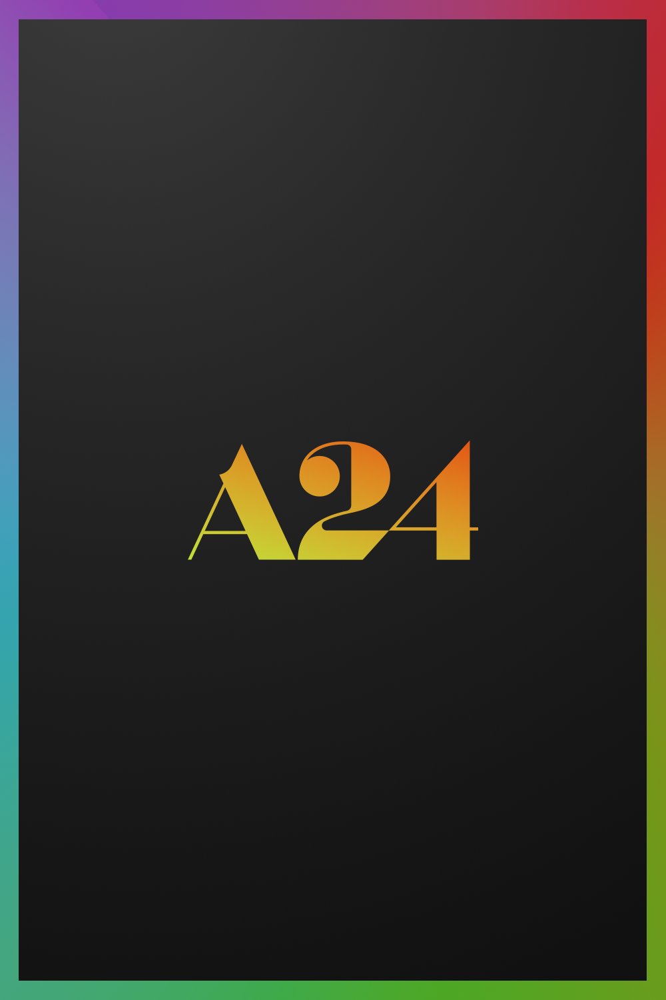
  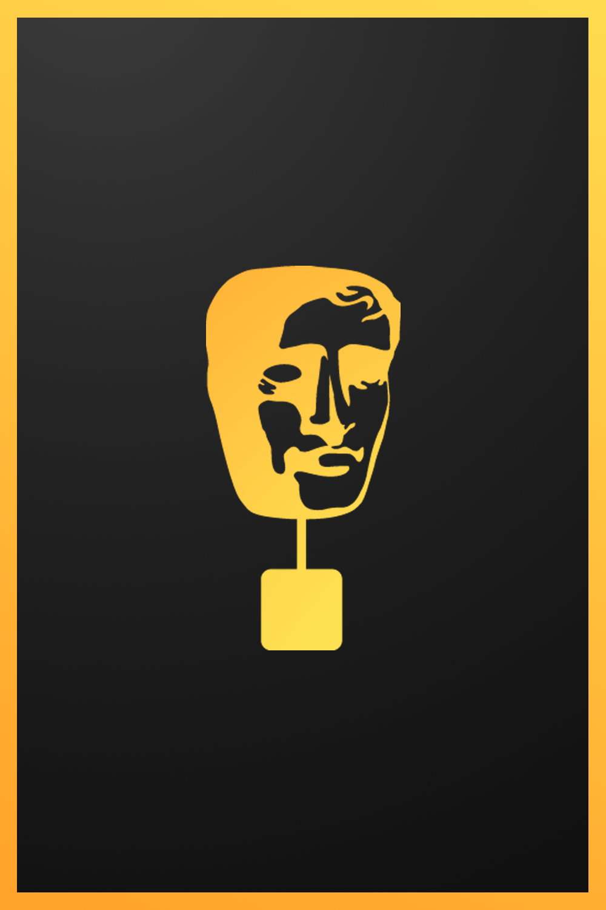
  
  
  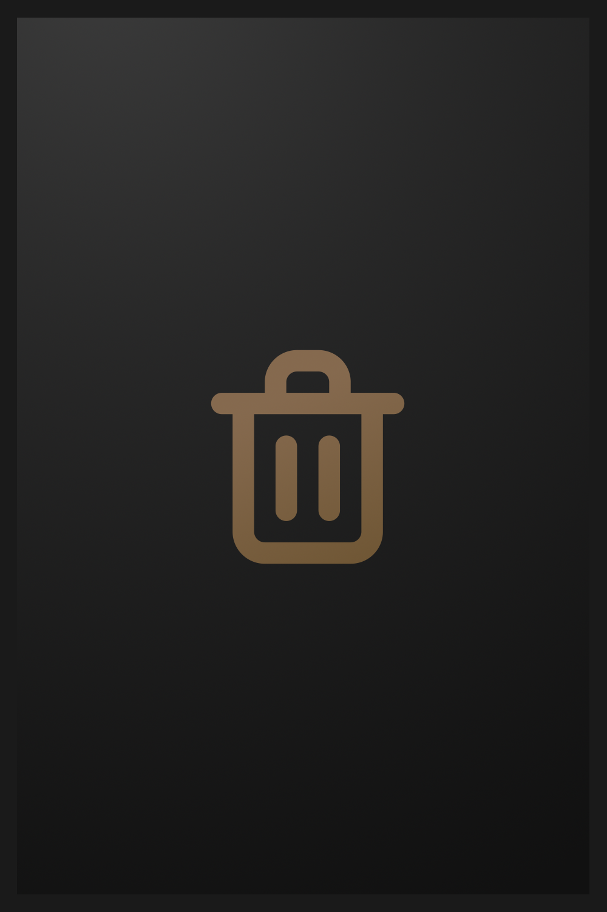
  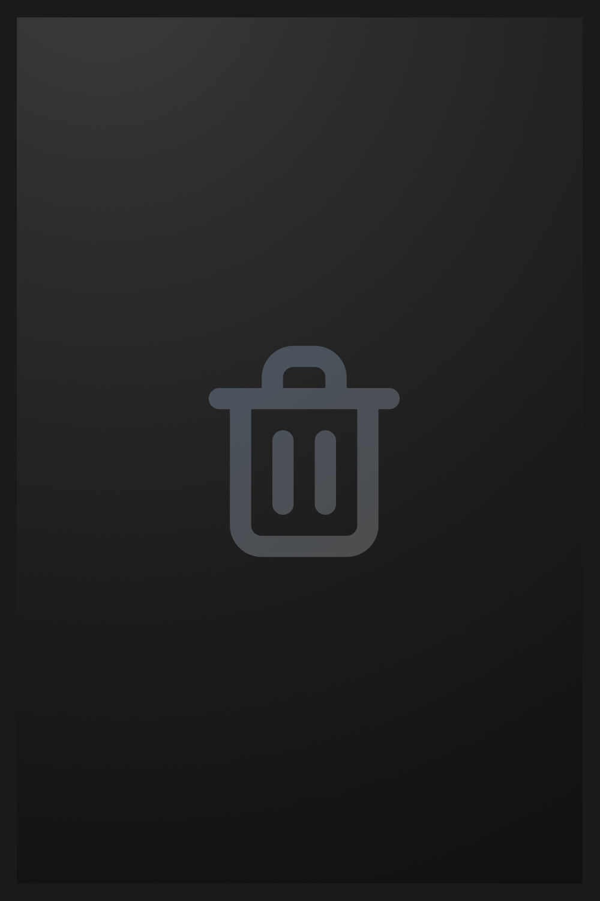
  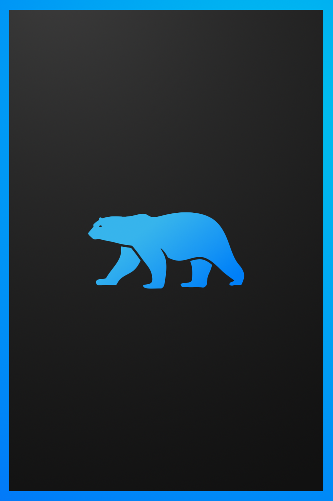
  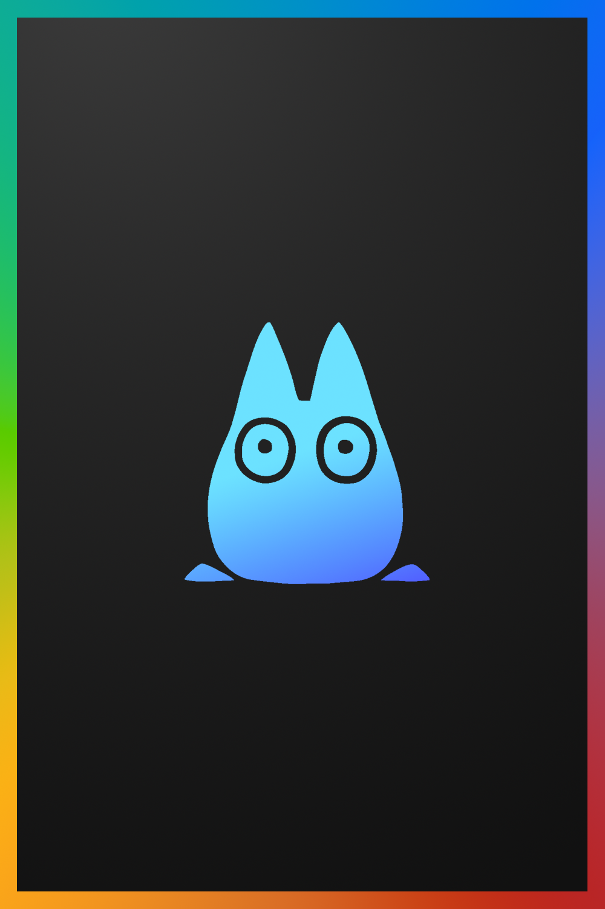
  
  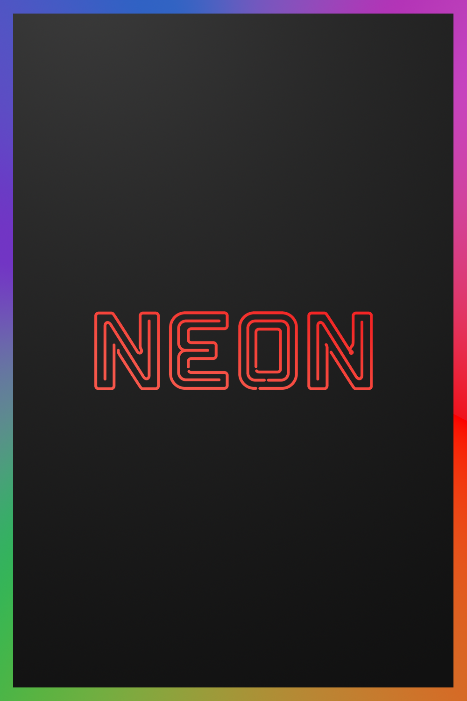
  
  
  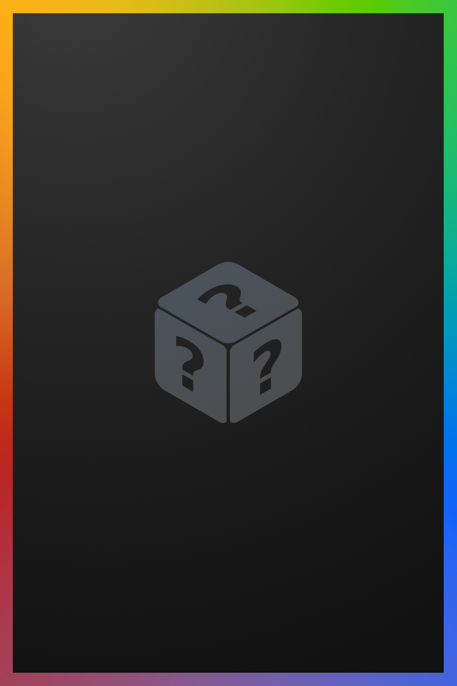
  
  
  
  
  
  
  
</p>

---

## 📁 Included Collections

Collection YAML files located under `craftwork2720/collections/`:

* `basic_movies.yml` – Basic movie collections
* `basic_shows.yml` – Basic TV show collections
* `delete.yml` – Items marked for removal
* `documentary.yml` – Documentaries grouped together
* `miniseries.yml` – Identifies and groups miniseries
* `random_movies.yml` – Random picks from your movie library
* `random_shows.yml` – Random picks from your TV shows library


```yaml
collection_files:
  - file: config/craftwork2720/collections/basic_movies.yml
  - file: config/craftwork2720/collections/basic_shows.yml
  - file: config/craftwork2720/collections/delete.yml
  - file: config/craftwork2720/collections/documentary.yml
  - file: config/craftwork2720/collections/miniseries.yml
  - file: config/craftwork2720/collections/random_movies.yml
  - file: config/craftwork2720/collections/random_shows.yml
```